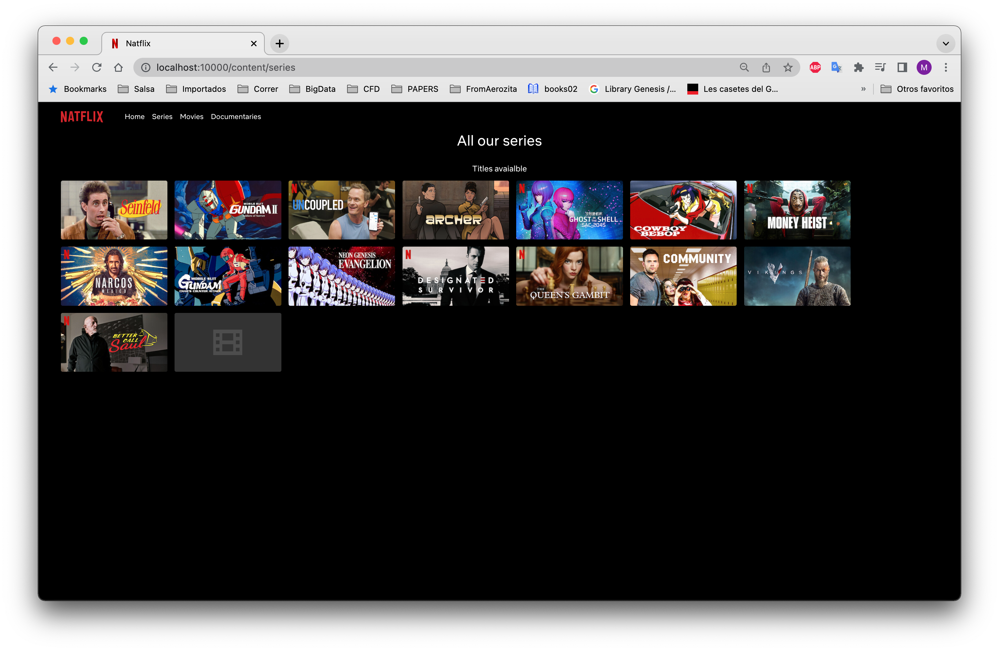
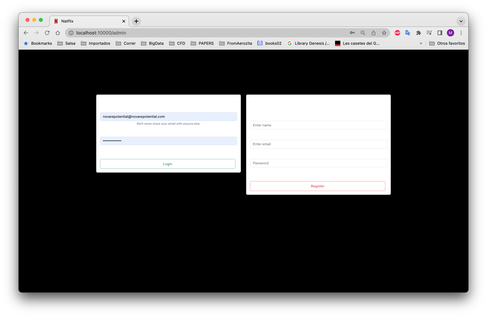
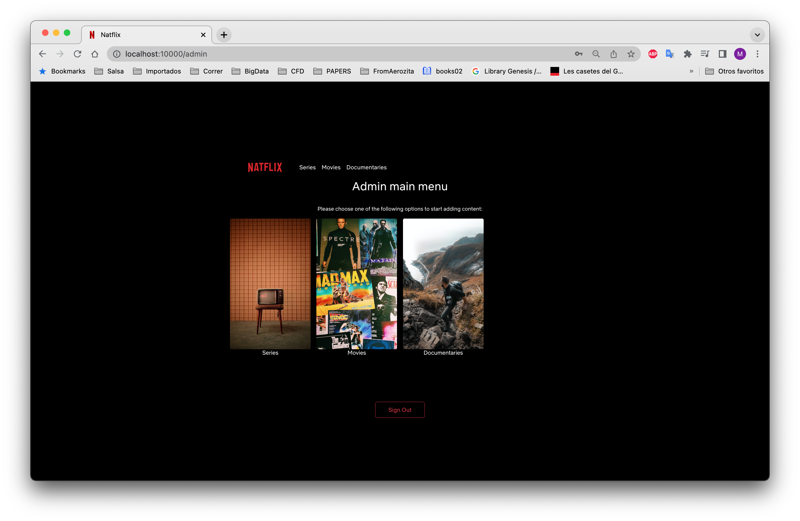
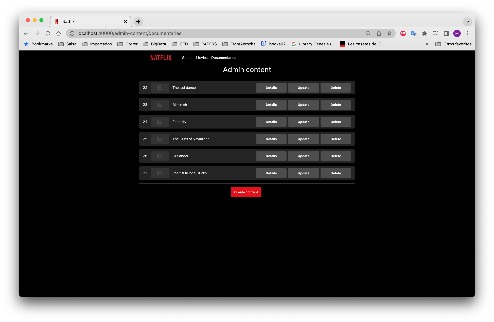

# NetflixFake


## FrontEnd 

**HowTo**
```
cd FrontEnd
bash WORKFLOW.sh
```

**Captured images**

 







## BackEnd


## References 

[React in Docker](https://tiangolo.medium.com/react-in-docker-with-nginx-built-with-multi-stage-docker-builds-including-testing-8cc49d6ec305)

[404 Not Found with Docker, React Router and Nginx](https://patrickjamesoneill.medium.com/404-not-found-with-docker-react-router-and-nginx-21fdce02c5)


